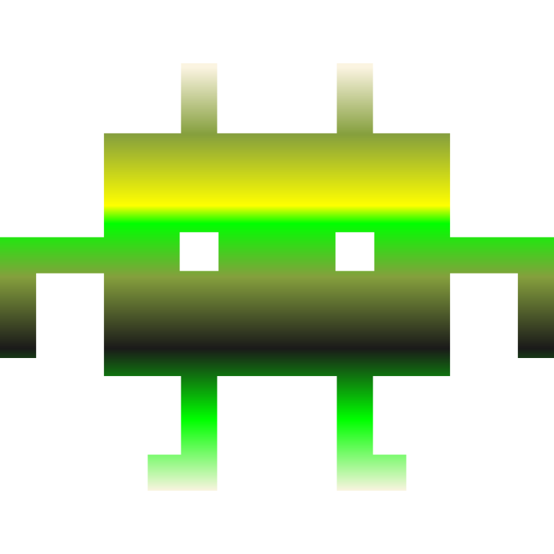
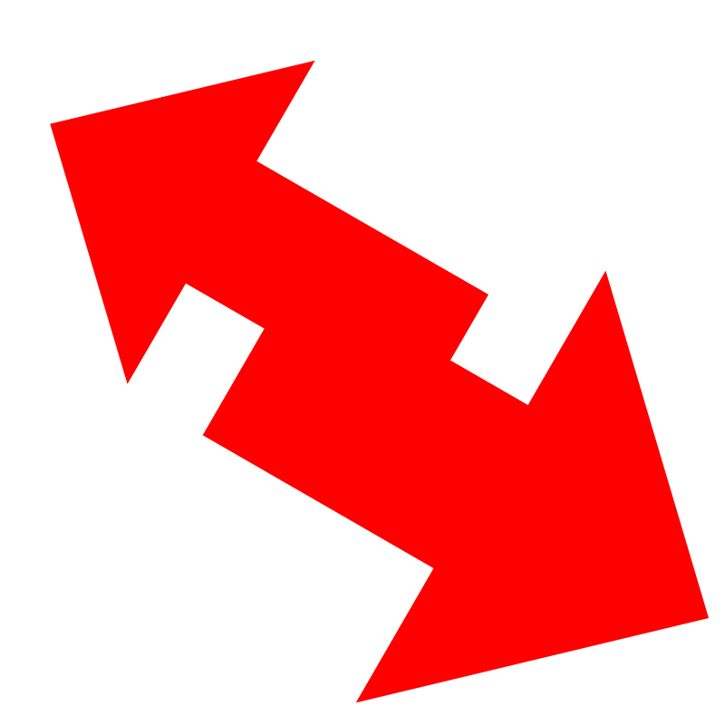
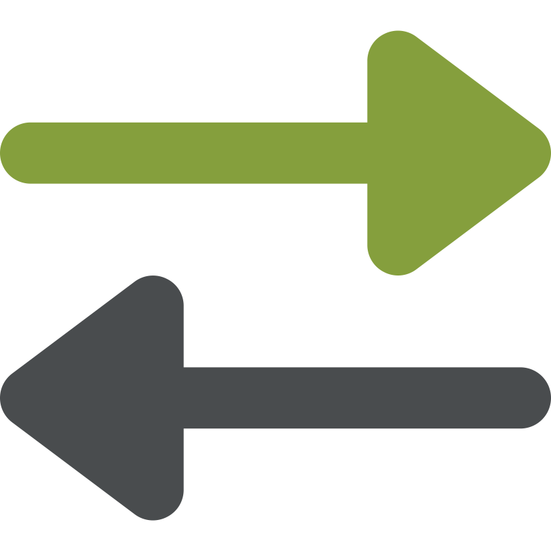
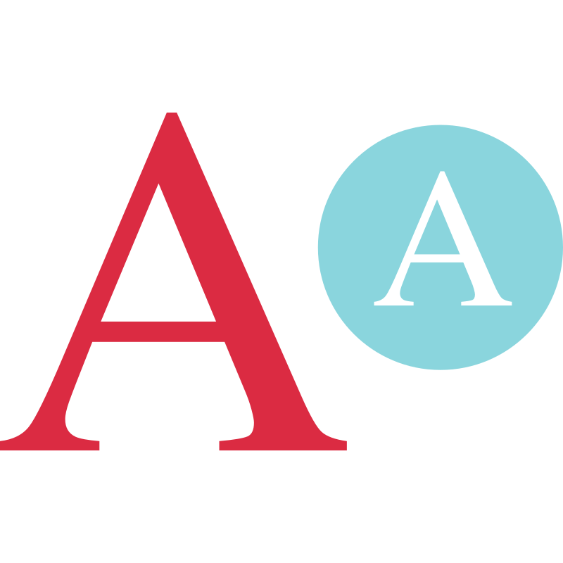
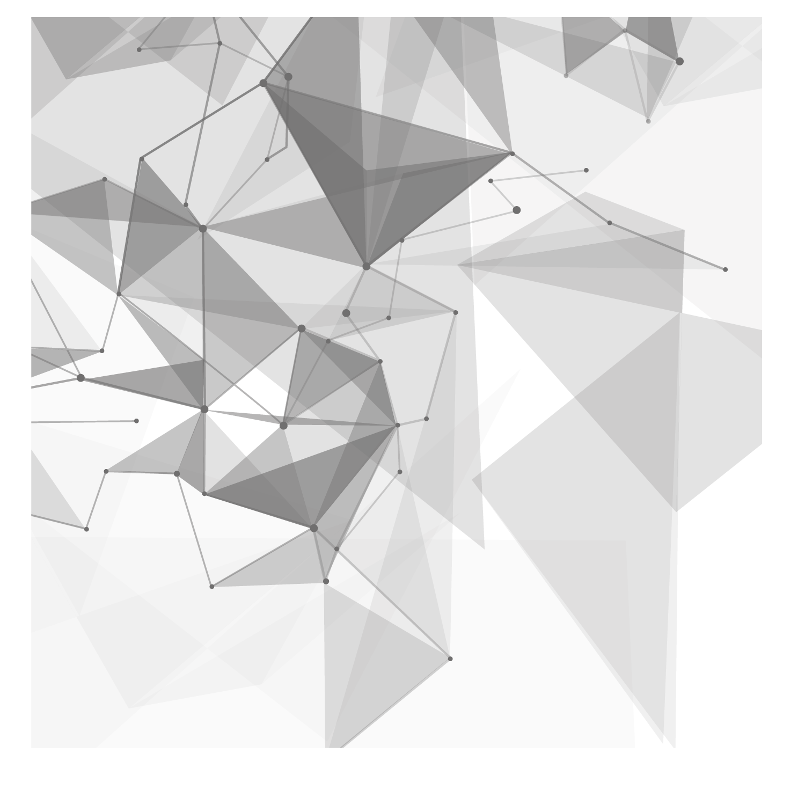
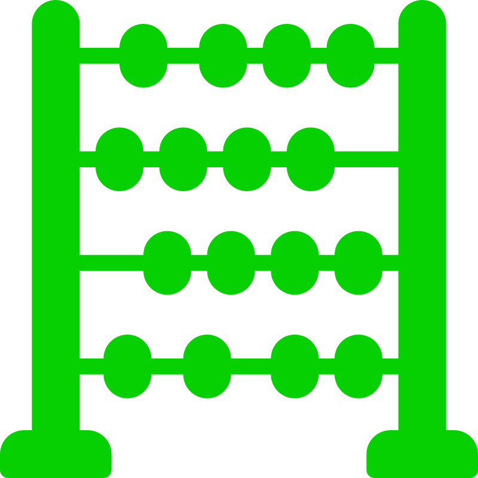

$$
{\color{red}Algorithm \space 🔱  \space \color{lightgreen}Challenge}
$$

$$
{\color{red}Made \space \color{red} With \space \color{red}❤️ }
$$


A very good place to practice algorithms is [LeetCode](https://leetcode.com) - this exercise contains practice challenges similar to the problems found on LeetCode.



## Table of Contents 🏽 🏼 🏻 🏿 🏾

- [Table of Contents 🏽 🏼 🏻 🏿 🏾](#table-of-contents-----)
- [Introduction](#introduction)
- [Installation](#installation)
- [Challenge 1: Reverse a String ](#challenge-1-reverse-a-string-)
- [Challenge 2: Validate a Palindrome ](#challenge-2-validate-a-palindrome-)
- [Challenge 3: Reverse an Integer ](#challenge-3-reverse-an-integer-)
- [Challenge 4: Capitalize Letters ](#challenge-4-capitalize-letters-)
- [Challenge 5: Max Character ](#challenge-5-max-character-)
- [Challenge 6: FizzBuzz ](#challenge-6-fizzbuzz-)
- [Challenge 7: Longest Word ](#challenge-7-longest-word-)
- [Challenge 8: Array Chunking ](#challenge-8-array-chunking-)
- [Challenge 9: Flatten Array ](#challenge-9-flatten-array-)
- [Challenge 10: Anagram ](#challenge-10-anagram-)
- [Challenge 11: Add All Numbers ](#challenge-11-add-all-numbers-)
- [Challenge 12: Sum All Primes ](#challenge-12-sum-all-primes-)
- [Challenge 13: Seek and Destroy ](#challenge-13-seek-and-destroy-)
- [Challenge 14: Even \& Odd Sums ](#challenge-14-even--odd-sums-)

## Introduction

This repository contains a collection of algorithm challenges designed to help you improve your JavaScript skills. Each challenge includes a brief description and an example to illustrate the expected output. Whether you are a beginner or an experienced developer, these challenges will help you practice and enhance your problem-solving abilities.

## Installation

To set up the project locally, follow these steps:

1. Clone the repository:
   ```sh
   git clone https://github.com/your-username/algorithm-challenges.git
   ```

## Challenge 1: Reverse a String 

```javascript
// Return a string in reverse
// ex:
reverseString("hello") === "olleh";
```

**Explanation:** This challenge requires you to write a function that takes a string as input and returns the string in reverse order. For example, if the input is "hello", the output should be "olleh".

## Challenge 2: Validate a Palindrome 

```javascript
// Return true if palindrome and false if not
// ex:
isPalindrome("racecar") === true;
isPalindrome("hello") === false;
```

**Explanation:** A palindrome is a word, phrase, number, or other sequence of characters that reads the same forward and backward (ignoring spaces, punctuation, and capitalization). This challenge requires you to write a function that checks if a given string is a palindrome.

## Challenge 3: Reverse an Integer 

```javascript
// Return an integer in reverse
// ex:
reverseInt(521) === 125;
```

**Explanation:** This challenge requires you to write a function that takes an integer as input and returns the integer with its digits reversed. For example, if the input is 521, the output should be 125.

## Challenge 4: Capitalize Letters 

```javascript
// Return a string with the first letter of every word capitalized
// ex:
capitalizeLetters("i love javascript") === "I Love Javascript";
```

**Explanation:** This challenge requires you to write a function that takes a string as input and returns the string with the first letter of each word capitalized. For example, if the input is "i love javascript", the output should be "I Love Javascript".

## Challenge 5: Max Character 

```javascript
// Return the character that is most common in a string
// ex:
maxCharacter("javascript") === "a";
```

**Explanation:** This challenge requires you to write a function that takes a string as input and returns the character that appears most frequently in the string. For example, if the input is "javascript", the output should be "a".

## Challenge 6: FizzBuzz 

```javascript
// Write a program that prints all the numbers from 1 to 100. For multiples of 3, instead of the number, print "Fizz", for multiples of 5 print "Buzz". For numbers which are multiples of both 3 and 5, print "FizzBuzz".
```

**Explanation:** FizzBuzz is a classic programming challenge that requires you to write a program that prints the numbers from 1 to 100. However, for multiples of 3, you should print "Fizz" instead of the number, for multiples of 5, you should print "Buzz", and for multiples of both 3 and 5, you should print "FizzBuzz".

## Challenge 7: Longest Word 

```javascript
// Return the longest word of a string
// SOLUTION 1 - Return a single longest word
// SOLUTION 2 - Return an array and include multiple words if they have the same length
// SOLUTION 3 - Only return an array if multiple words, otherwise return a string
// ex:
longestWord("Hi there, my name is Brad") === "there,";
longestWord("My name is Brad") === ["name", "brad"];
longestWord("Brad") === "brad";
```

**Explanation:** This challenge requires you to write a function that takes a string as input and returns the longest word in the string. If there are multiple words with the same length, you can return an array of those words.

## Challenge 8: Array Chunking 

```javascript
// Split an array into chunked arrays of a specific length
// ex:
chunkArray([1, 2, 3, 4, 5, 6, 7], 3) === [[1, 2, 3], [4, 5, 6], [7]];
chunkArray([1, 2, 3, 4, 5, 6, 7], 2) === [[1, 2], [3, 4], [5, 6], [7]];
```

**Explanation:** This challenge requires you to write a function that takes an array and a chunk size as input and splits the array into smaller arrays (chunks) of the specified size. For example, if the input array is [1, 2, 3, 4, 5, 6, 7] and the chunk size is 3, the output should be [[1, 2, 3], [4, 5, 6], [7]].

## Challenge 9: Flatten Array 

```javascript
// Take an array of arrays and flatten to a single array
// ex:
[[1, 2], [3, 4], [5, 6], [7]] === [1, 2, 3, 4, 5, 6, 7];
```

**Explanation:** This challenge requires you to write a function that takes an array of arrays as input and flattens it into a single array. For example, if the input is [[1, 2], [3, 4], [5, 6], [7]], the output should be [1, 2, 3, 4, 5, 6, 7].

## Challenge 10: Anagram 

```javascript
// Return true if anagram and false if not
// ex:
"anagram" === "nagaram";
"Dormitory" === "dirty room##";
```

**Explanation:** An anagram is a word or phrase formed by rearranging the letters of another word or phrase. This challenge requires you to write a function that takes two strings as input and returns true if they are anagrams of each other, and false otherwise.

## Challenge 11: Add All Numbers 

```javascript
// Return a sum of all parameters entered regardless of the amount of numbers
// ex:
addAll(2, 5, 6, 7) === 20;
```

**Explanation:** This challenge requires you to write a function that takes any number of arguments and returns their sum. For example, if the input is 2, 5, 6, 7, the output should be 20.

## Challenge 12: Sum All Primes 

```javascript
// Pass in a number to loop up to and add all of the prime numbers. A prime number is a whole number greater than 1 whose only factors are 1 and itself
// ex:
sumAllPrimes(10) === 17;
```

**Explanation:** A prime number is a whole number greater than 1 whose only factors are 1 and itself. This challenge requires you to write a function that takes a number as input and returns the sum of all prime numbers up to that number. For example, if the input is 10, the output should be 17 (2 + 3 + 5 + 7).

## Challenge 13: Seek and Destroy 

```javascript
// Remove from the array whatever is in the following arguments. Return the leftover numbers in an array
// ex:
seekAndDestroy([2, 3, 4, 6, 6, "hello"], 2, 6) === [3, 4, "hello"];
```

**Explanation:** This challenge requires you to write a function that takes an array and additional arguments, and removes all elements from the array that match any of the additional arguments. For example, if the input is [2, 3, 4, 6, 6, "hello"], 2, 6, the output should be [3, 4, "hello"].

## Challenge 14: Even & Odd Sums 

```javascript
// Take in an array and return an array of the sums of even and odd numbers
// ex:
evenOddSums([50, 60, 60, 45, 71]) === [170, 116];
```

**Explanation:** This challenge requires you to write a function that takes an array as input and returns an array with two elements: the sum of all even numbers and the sum of all odd numbers. For example, if the input is [50, 60, 60, 45, 71], the output should be [170, 116].

$$
$$
