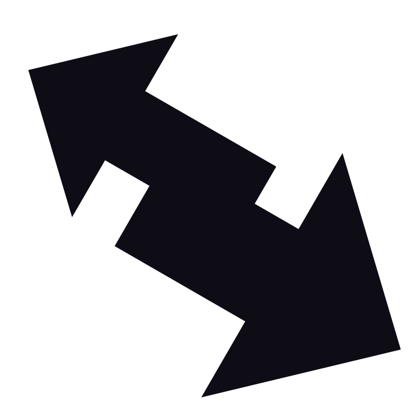

$$
{\color{red}Algorithm \space 🔱  \space \color{lightblue}Challenge}
$$


A very good place to practice algorithms is [LeetCode](https://leetcode.com) - this exercise contains practice challenges similar to the problems found on LeetCode.


## Table of Contents 🏽 🏼 🏻 🏿 🏾

- [Table of Contents 🏽 🏼 🏻 🏿 🏾](#table-of-contents-----)
- [Introduction](#introduction)
- [Installation](#installation)
- [Challenge 1: Reverse a String ](#challenge-1-reverse-a-string-)
- [Challenge 2: Validate a Palindrome](#challenge-2-validate-a-palindrome)
- [Challenge 3: Reverse an Integer ](#challenge-3-reverse-an-integer-)
- [Challenge 4: Capitalize Letters ](#challenge-4-capitalize-letters-)
- [Challenge 5: Max Character](#challenge-5-max-character)
- [Challenge 6: FizzBuzz ](#challenge-6-fizzbuzz-)
- [Challenge 7: Longest Word](#challenge-7-longest-word)
- [Challenge 8: Array Chunking](#challenge-8-array-chunking)
- [Challenge 9: Flatten Array](#challenge-9-flatten-array)
- [Challenge 10: Anagram ](#challenge-10-anagram-)
- [Challenge 11: Add All Numbers](#challenge-11-add-all-numbers)
- [Challenge 12: Sum All Primes](#challenge-12-sum-all-primes)
- [Challenge 13: Seek and Destroy](#challenge-13-seek-and-destroy)
- [Challenge 14: Even \& Odd Sums](#challenge-14-even--odd-sums)

## Introduction

This repository contains a collection of algorithm challenges designed to improve your problem-solving skills. Each challenge includes a description and example code to help you get started.

## Installation

To set up the project locally, follow these steps:

1. Clone the repository:
   ```sh
   git clone https://github.com/your-username/algorithm-challenges.git
   ```

## Challenge 1: Reverse a String 

```javascript
// Return a string in reverse
// ex:
reverseString("hello") === "olleh";
```

## Challenge 2: Validate a Palindrome


```javascript
// Return true if palindrome and false if not
// ex:
isPalindrome("racecar") === true;
isPalindrome("hello") === false;
```

## Challenge 3: Reverse an Integer 

```javascript
// Return an integer in reverse
// ex:
reverseInt(521) === 125;
```

## Challenge 4: Capitalize Letters 

```javascript
// Return a string with the first letter of every word capitalized
// ex:
capitalizeLetters("i love javascript") === "I Love Javascript";
```

## Challenge 5: Max Character


```javascript
// Return the character that is most common in a string
// ex:
maxCharacter("javascript") === "a";
```

## Challenge 6: FizzBuzz 

```javascript
// Write a program that prints all the numbers from 1 to 100. For multiples of 3, instead of the number, print "Fizz", for multiples of 5 print "Buzz". For numbers which are multiples of both 3 and 5, print "FizzBuzz".
```

## Challenge 7: Longest Word


```javascript
// Return the longest word of a string
// SOLUTION 1 - Return a single longest word
// SOLUTION 2 - Return an array and include multiple words if they have the same length
// SOLUTION 3 - Only return an array if multiple words, otherwise return a string
// ex:
longestWord("Hi there, my name is Brad") === "there,";
longestWord("My name is Brad") === ["name", "brad"];
longestWord("Brad") === "brad";
```

## Challenge 8: Array Chunking


```javascript
// Split an array into chunked arrays of a specific length
// ex:
chunkArray([1, 2, 3, 4, 5, 6, 7], 3) === [[1, 2, 3], [4, 5, 6], [7]];
chunkArray([1, 2, 3, 4, 5, 6, 7], 2) === [[1, 2], [3, 4], [5, 6], [7]];
```

## Challenge 9: Flatten Array


```javascript
// Take an array of arrays and flatten to a single array
// ex:
[[1, 2], [3, 4], [5, 6], [7]] === [1, 2, 3, 4, 5, 6, 7];
```

## Challenge 10: Anagram 

```javascript
// Return true if anagram and false if not
// ex:
"anagram" === "nagaram";
"Dormitory" === "dirty room##";
```

## Challenge 11: Add All Numbers


```javascript
// Return a sum of all parameters entered regardless of the amount of numbers
// ex:
addAll(2, 5, 6, 7) === 20;
```

## Challenge 12: Sum All Primes


```javascript
// Pass in a number to loop up to and add all of the prime numbers. A prime number is a whole number greater than 1 whose only factors are 1 and itself
// ex:
sumAllPrimes(10) === 17;
```

## Challenge 13: Seek and Destroy


```javascript
// Remove from the array whatever is in the following arguments. Return the leftover numbers in an array
// ex:
seekAndDestroy([2, 3, 4, 6, 6, "hello"], 2, 6) === [3, 4, "hello"];
```

## Challenge 14: Even & Odd Sums


```javascript
// Take in an array and return an array of the sums of even and odd numbers
// ex:
evenOddSums([50, 60, 60, 45, 71]) === [170, 116];
```

$$
$$
